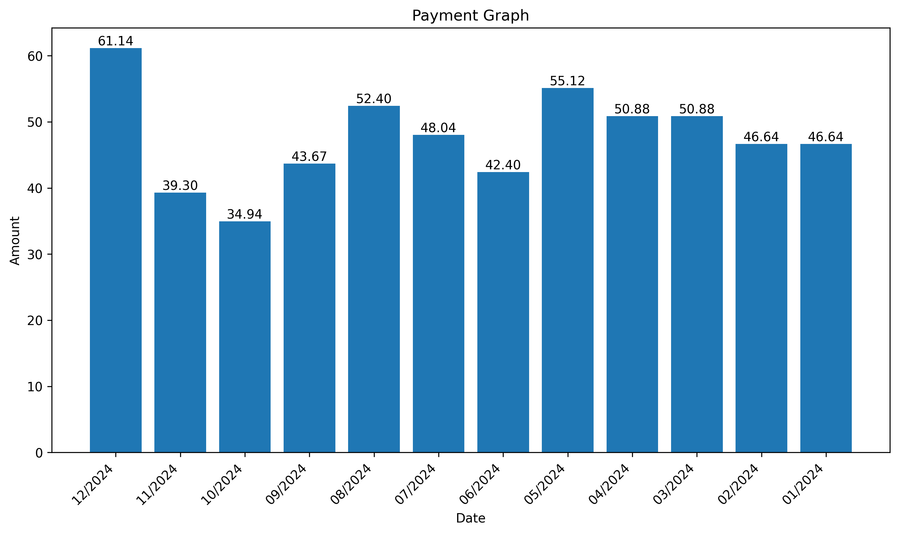

# Invoice Graph Web App 📊

A FastAPI-based web application that automatically processes bill invoices from Gmail attachments, extracts payment data, and generates visual payment graphs. Users authenticate with Google OAuth, and the app securely stores tokens and session data in PostgreSQL.

🌐 **Live Demo:** [https://invoice-graph.org](https://invoice-graph.org)

---

## Features ✨

- **🔐 Google OAuth Authentication**: Secure login with Google accounts
- **📧 Gmail Integration**: Automatically searches and retrieves email attachments
- **📄 Bill Processing**: Extracts payment information from PDF/image attachments
- **📈 Data Visualization**: Generates interactive payment graphs
- **💾 Secure Storage**: Encrypted token storage in PostgreSQL
- **📥 Export Options**: Download graphs as PNG or PDF
- **🔒 Session Management**: Secure session handling with encrypted cookies
- **🐳 Docker Ready**: Containerized deployment with Docker Compose

---

## Tech Stack 🛠️

### Backend
- **FastAPI** - Python web framework
- **PostgreSQL** - Production database

### Authentication & Security
- **Google OAuth 2.0** - User authentication
- **Cryptography** - Token encryption
- **Starlette SessionMiddleware** - Session management

### Infrastructure
- **Docker & Docker Compose** - Containerization
- **Nginx** - Reverse proxy (production)
- **Let's Encrypt** - SSL/TLS certificates

---

## Architecture 🏗️

```
┌─────────────┐
│   Browser   │
└──────┬──────┘
       │ HTTPS
       ▼
┌─────────────┐
│    Nginx    │ (Reverse Proxy + SSL)
└──────┬──────┘
       │ HTTP
       ▼
┌─────────────┐
│   FastAPI   │ (Application Logic)
└──────┬──────┘
       │
       ├─────────────► PostgreSQL (User data, sessions, encrypted tokens)
       │
       └─────────────► Gmail API (Fetch emails & attachments)
```

---

## Prerequisites 📋

- Python 3.11+
- PostgreSQL 15+
- Docker & Docker Compose (for production)
- Google Cloud Platform account (for OAuth credentials)


## Project Structure 📁

```
Invoice-Graph-Web-App/
├── main.py                 # FastAPI application entry point
├── storage.py             # Database operations (sessions, tokens)
├── model.py               # SQLAlchemy models
├── db.py                  # Database configuration
├── gmail_auth.py          # Google OAuth authentication
├── gmail.py               # Gmail API integration
├── bill.py                # invoice parser
├── graph_plot.py          # Graph generation
├── crypto.py              # Encryption utilities
├── templates/             # Jinja2 HTML templates
│    ├── graph.html
│    └── index.html
├── requirements.txt       # Python dependencies
├── Dockerfile            # Docker image definition
├── docker-compose.yml    # Docker services configuration
├── .env.example          # Environment template
├── .env      # Local config (NOT committed)
├── .gitignore
└── README.md
```

---

## Usage 📖

1. **Visit the website:** Navigate to your deployed URL
2. **Login with Google:** Click "Login" and authenticate
3. **Enter search criteria:**
   - Email address to search
   - Subject filter (optional)
   - Keyword filter (optional)
   - Currency type
   - Date range
4. **Process bills:** The app will:
   - Search Gmail for matching emails
   - Download attachments
   - Extract payment data
   - Generate a visual graph
5. **Download graph:** Export as PNG or PDF
   - Example of graph.png output-

---

## License 📄

This project is licensed under the MIT License - see the [LICENSE](LICENSE) file for details.

